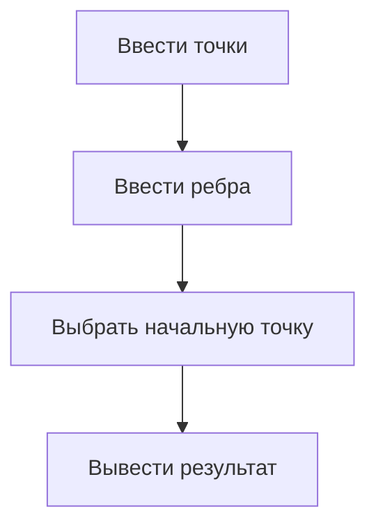

WARNING! На данный момент программа в стадии полного переделывания

Программа для визуального отображения алгоритма Дейкстры

Два проекта - один библиотека, второй - визуал

Инструкция к визуальной части:
1) Точки вводятся с помощью кнопки "Добавить", значения берутся из полей "x" и "y" соответственно
2) Для работы алгоритма необходимо выбрать номер начальной точки и надать на кнопку "Посчитать"
3) Для каждого списка (точек и ребер) доступно свое контекстное меню с возможностью удалить элемент и соединить точки/изменить вес ребра(для изменения веса необходимо ввести вес в соответствующее поле)
4) Есть возможность импорта из excel (кнопка "Загрузить"), решения экспортируются в ворд

